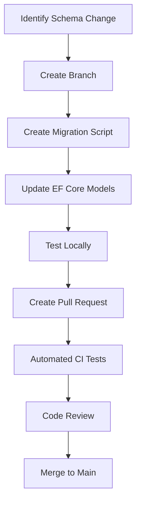

# CI/CD for Database Changes

This document outlines our strategy for managing database schema changes in the CI/CD pipeline for the Golf Tournament Organizer application.

## Overview

Database changes are managed using a combination of:

1. **Migration scripts**: Version-controlled SQL scripts
2. **EF Core migrations**: For .NET model changes
3. **Supabase RLS changes**: Security policy updates
4. **Automated testing**: Validation of changes
5. **Controlled deployment**: Safe application through CI/CD

## Migration Framework

### Directory Structure

```
src/
├── api/
│   ├── GolfApp.Api/
│   │   ├── Data/
│   │   │   ├── Migrations/           # EF Core migrations
│   │   │   └── GolfAppContext.cs     # DbContext
│   │   └── Models/                   # Entity models
└── db/
    ├── migrations/                   # Raw SQL migrations
    │   ├── 0001_initial_schema.sql
    │   ├── 0002_add_tournament_fields.sql
    │   └── ...
    ├── seed/                         # Seed data scripts
    │   ├── dev_data.sql
    │   └── test_data.sql
    └── rls/                          # Row Level Security policies
        ├── tournaments_policy.sql
        └── scores_policy.sql
```

### Migration Versioning

All migrations follow a sequential numbering scheme:

- **Format**: `{sequence}_{description}.sql`
- **Example**: `0042_add_player_handicap.sql`

Each migration script contains:

1. **Metadata header**: Information about the migration
2. **Up migration**: Changes to apply
3. **Down migration**: Changes to revert
4. **Validation**: Tests to verify success

Example migration script:

```sql
-- Migration: 0042_add_player_handicap
-- Description: Add handicap field to tournament_players table
-- Author: Jane Developer
-- Date: 2023-06-10
-- Jira: GOLF-123

-- === UP MIGRATION ===
ALTER TABLE tournament_players
ADD COLUMN handicap DECIMAL(4,1) NULL;

COMMENT ON COLUMN tournament_players.handicap IS 'Player handicap at time of tournament';

-- === DOWN MIGRATION ===
ALTER TABLE tournament_players
DROP COLUMN handicap;

-- === VALIDATION ===
DO $$
BEGIN
    -- Check if column exists
    IF NOT EXISTS (
        SELECT 1
        FROM information_schema.columns
        WHERE table_name = 'tournament_players' AND column_name = 'handicap'
    ) THEN
        RAISE EXCEPTION 'Migration failed: handicap column not found';
    END IF;
END $$;
```

## CI/CD Workflow

### 1. Migration Development

Developers follow this process for database changes:



#### Local Development Workflow

```bash
# Create a new migration script
./scripts/create-migration.ps1 "add_player_handicap"

# Apply migrations to local database
./scripts/apply-migrations.ps1 -local
```

### 2. CI Build Phase

In the CI pipeline, migrations are tested against a clean database:

```yaml
steps:
  - name: Setup Test Database
    run: |
      docker-compose up -d test-db
      ./scripts/setup-test-db.ps1
      
  - name: Validate Migrations
    run: |
      # Test if migrations can be applied
      ./scripts/apply-migrations.ps1 -ci
      
      # Test if migrations can be rolled back
      ./scripts/rollback-migrations.ps1 -ci
      
      # Run validation queries
      ./scripts/validate-schema.ps1
```

### 3. CD Deployment Phase

When deploying to production, the migration process is:

```yaml
steps:
  - name: Backup Database
    run: ./scripts/backup-database.ps1 -env production
    
  - name: Apply Schema Changes
    run: |
      # Apply with timeout and retry
      ./scripts/apply-migrations.ps1 -env production -timeout 300s -retry 3
    
  - name: Validate Schema
    run: ./scripts/validate-schema.ps1 -env production
    
  - name: Health Check
    run: ./scripts/api-healthcheck.ps1 -env production
```

## Migration Scripts

### Migration Applier Tool

Our migration tool handles applying changes safely:

```csharp
public class MigrationRunner
{
    private readonly string _connectionString;
    private readonly ILogger _logger;
    
    public MigrationRunner(string connectionString, ILogger logger)
    {
        _connectionString = connectionString;
        _logger = logger;
    }
    
    public async Task ApplyMigrationsAsync(string migrationsPath, bool validateOnly = false)
    {
        // Get list of migration files
        var migrationFiles = Directory.GetFiles(migrationsPath, "*.sql")
            .OrderBy(f => Path.GetFileName(f))
            .ToList();
            
        _logger.LogInformation($"Found {migrationFiles.Count} migration files");
        
        // Get applied migrations from database
        var appliedMigrations = await GetAppliedMigrationsAsync();
        
        // Find pending migrations
        var pendingMigrations = migrationFiles
            .Where(f => !appliedMigrations.Contains(Path.GetFileNameWithoutExtension(f)))
            .ToList();
            
        _logger.LogInformation($"Found {pendingMigrations.Count} pending migrations");
        
        if (validateOnly)
        {
            _logger.LogInformation("Validation only mode - not applying migrations");
            return;
        }
        
        // Apply each migration in a transaction
        foreach (var migrationFile in pendingMigrations)
        {
            await ApplyMigrationAsync(migrationFile);
        }
    }
    
    private async Task ApplyMigrationAsync(string migrationFile)
    {
        var migrationName = Path.GetFileNameWithoutExtension(migrationFile);
        _logger.LogInformation($"Applying migration: {migrationName}");
        
        var migrationSql = File.ReadAllText(migrationFile);
        var upMigrationSql = ExtractUpMigration(migrationSql);
        var validationSql = ExtractValidationSql(migrationSql);
        
        using var connection = new NpgsqlConnection(_connectionString);
        await connection.OpenAsync();
        
        using var transaction = await connection.BeginTransactionAsync();
        
        try
        {
            // Apply migration
            using (var command = new NpgsqlCommand(upMigrationSql, connection, transaction))
            {
                await command.ExecuteNonQueryAsync();
            }
            
            // Run validation if present
            if (!string.IsNullOrEmpty(validationSql))
            {
                using var validationCommand = new NpgsqlCommand(validationSql, connection, transaction);
                await validationCommand.ExecuteNonQueryAsync();
            }
            
            // Record migration in migrations table
            await RecordMigrationAsync(connection, transaction, migrationName);
            
            await transaction.CommitAsync();
            _logger.LogInformation($"Migration {migrationName} applied successfully");
        }
        catch (Exception ex)
        {
            await transaction.RollbackAsync();
            _logger.LogError(ex, $"Failed to apply migration {migrationName}");
            throw;
        }
    }
    
    // Helper methods for extracting parts of the migration script
    // and tracking applied migrations in the database
    // ...
}
```

## Handling Breaking Changes

Breaking schema changes require special handling in the CI/CD pipeline:

### 1. Database Versioning

The application uses database versioning to handle compatibility:

```csharp
public class DatabaseVersionCheck
{
    public static async Task CheckDatabaseCompatibility(IServiceProvider services)
    {
        var context = services.GetRequiredService<GolfAppContext>();
        var logger = services.GetRequiredService<ILogger<DatabaseVersionCheck>>();
        
        var dbVersion = await context.DatabaseVersion.OrderByDescending(v => v.MajorVersion)
            .ThenByDescending(v => v.MinorVersion)
            .FirstOrDefaultAsync();
            
        if (dbVersion == null)
        {
            logger.LogError("No database version found - cannot start application");
            throw new InvalidOperationException("Database is not initialized properly");
        }
        
        var requiredVersion = new { MajorVersion = 2, MinorVersion = 5 }; // Current app version
        
        if (dbVersion.MajorVersion < requiredVersion.MajorVersion)
        {
            logger.LogError("Database version {DbVersion} is not compatible with application version {AppVersion}",
                $"{dbVersion.MajorVersion}.{dbVersion.MinorVersion}",
                $"{requiredVersion.MajorVersion}.{requiredVersion.MinorVersion}");
                
            throw new InvalidOperationException("Database version is not compatible");
        }
        
        logger.LogInformation("Database version {DbVersion} is compatible with application version {AppVersion}",
            $"{dbVersion.MajorVersion}.{dbVersion.MinorVersion}",
            $"{requiredVersion.MajorVersion}.{requiredVersion.MinorVersion}");
    }
}
```

### 2. Blue-Green Deployment

For significant schema changes, we use a blue-green deployment approach:

1. **Deploy new schema**: Apply changes to database
2. **Deploy new API version**: Points to new schema
3. **Verify functionality**: Run tests and health checks
4. **Switch traffic**: Route users to new version
5. **Rollback plan**: Keep old version ready if issues arise

## Row-Level Security Management

Supabase Row-Level Security policies are also version controlled:

```sql
-- RLS policy for tournaments table

-- Drop existing policies
DROP POLICY IF EXISTS "Users can view their own tournaments" ON tournaments;
DROP POLICY IF EXISTS "Admins can view all tournaments" ON tournaments;

-- Apply updated policies
CREATE POLICY "Users can view their own tournaments"
  ON tournaments
  FOR SELECT
  USING (
    auth.uid() = created_by OR
    auth.uid() IN (
      SELECT player_id FROM tournament_players 
      WHERE tournament_id = id AND status = 'confirmed'
    )
  );

CREATE POLICY "Admins can view all tournaments"
  ON tournaments
  FOR SELECT
  USING (
    auth.uid() IN (
      SELECT user_id FROM tenant_users 
      WHERE tenant_id = tournaments.tenant_id AND role = 'admin'
    )
  );
```

These policies are applied as part of the migration process.

## Database Change Testing

### 1. Schema Validation Tests

Each migration includes validation tests to verify schema correctness:

```sql
-- Validation SQL
DO $$
BEGIN
    -- Verify table exists
    IF NOT EXISTS (SELECT 1 FROM information_schema.tables WHERE table_name = 'tournaments') THEN
        RAISE EXCEPTION 'Table tournaments does not exist';
    END IF;
    
    -- Verify columns
    IF NOT EXISTS (SELECT 1 FROM information_schema.columns 
                   WHERE table_name = 'tournaments' AND column_name = 'status') THEN
        RAISE EXCEPTION 'Column status does not exist';
    END IF;
    
    -- Verify constraints
    IF NOT EXISTS (SELECT 1 FROM information_schema.table_constraints 
                   WHERE table_name = 'tournaments' AND constraint_type = 'PRIMARY KEY') THEN
        RAISE EXCEPTION 'Primary key constraint missing';
    END IF;
END $$;
```

### 2. Integration Tests

Database changes are tested with integration tests:

```csharp
[Fact]
public async Task Tournament_Status_Transition_Should_Work()
{
    // Arrange
    var tournament = new Tournament
    {
        Name = "Test Tournament",
        Status = "draft"
    };
    await _dbContext.Tournaments.AddAsync(tournament);
    await _dbContext.SaveChangesAsync();
    
    // Act
    tournament.Status = "registration";
    await _dbContext.SaveChangesAsync();
    
    // Assert
    var refreshedTournament = await _dbContext.Tournaments.FindAsync(tournament.Id);
    Assert.Equal("registration", refreshedTournament.Status);
}
```

## Performance Considerations

### 1. Execution Time Limits

Migrations are designed with execution time in mind:

- **Small tables**: Direct ALTER TABLE operations
- **Large tables**: Create, copy, swap approach
- **Time monitoring**: Timeout if migrations take too long
- **Batching**: Split large operations into smaller batches

Example for altering a large table:

```sql
-- Instead of: ALTER TABLE large_table ADD COLUMN new_column TEXT;

-- 1. Create new table with desired schema
CREATE TABLE large_table_new (
    id UUID PRIMARY KEY,
    existing_column TEXT,
    new_column TEXT
);

-- 2. Copy data in batches
DO $$
DECLARE
    batch_size INT := 10000;
    max_id UUID;
    current_id UUID := '00000000-0000-0000-0000-000000000000';
BEGIN
    SELECT MAX(id) INTO max_id FROM large_table;
    
    WHILE current_id < max_id LOOP
        INSERT INTO large_table_new
        SELECT id, existing_column, NULL
        FROM large_table
        WHERE id > current_id
        ORDER BY id
        LIMIT batch_size;
        
        SELECT MAX(id) INTO current_id FROM large_table_new;
        
        COMMIT;
    END LOOP;
END $$;

-- 3. Swap tables
ALTER TABLE large_table RENAME TO large_table_old;
ALTER TABLE large_table_new RENAME TO large_table;

-- 4. Create indexes and constraints
CREATE INDEX idx_large_table_new_column ON large_table(new_column);

-- 5. Cleanup (after verification)
DROP TABLE large_table_old;
```

### 2. Lock Management

Migrations are designed to minimize table locks:

- **Concurrent indexes**: CREATE INDEX CONCURRENTLY
- **No-lock alterations**: Add nullable columns without locking
- **Off-peak scheduling**: Run migrations during low-traffic periods

## Emergency Rollback Procedure

If a deployment fails, we have an emergency rollback plan:

1. **Automatic rollback**: CI/CD pipeline detects failures and rolls back
2. **Manual intervention**: Emergency rollback script with admin credentials
3. **Point-in-time recovery**: Restore from backup if necessary

Emergency rollback script:

```bash
# rollback-emergency.ps1
param(
    [string]$environment = "production",
    [string]$migrationName = "",
    [switch]$fullRollback
)

Write-Host "EMERGENCY ROLLBACK PROCEDURE STARTED" -ForegroundColor Red

# Get current state
$currentState = ./scripts/get-migration-state.ps1 -env $environment

# Perform rollback
if ($fullRollback) {
    Write-Host "Performing FULL rollback to last known good state" -ForegroundColor Yellow
    ./scripts/restore-database.ps1 -env $environment -latest
} else {
    Write-Host "Rolling back specific migration: $migrationName" -ForegroundColor Yellow
    ./scripts/rollback-migration.ps1 -env $environment -migration $migrationName
}

# Verify system health
$healthStatus = ./scripts/system-health-check.ps1 -env $environment -full

if ($healthStatus -eq 0) {
    Write-Host "Rollback SUCCESSFUL - system health check passed" -ForegroundColor Green
} else {
    Write-Host "Rollback completed but system health check FAILED" -ForegroundColor Red
    Write-Host "Manual intervention required!" -ForegroundColor Red
}
```

## Monitoring and Alerts

Database changes are monitored during and after deployment:

1. **Performance metrics**: Query execution times before and after
2. **Error rates**: Application errors related to database
3. **Connection pools**: Connection usage patterns
4. **Alert thresholds**: Notifications for abnormal metrics

Alert configuration:

```json
{
  "alerts": [
    {
      "name": "Database Migration Alert",
      "description": "Alerts when database migration fails or causes issues",
      "conditions": [
        {
          "type": "metricThreshold",
          "metric": "database.error_rate",
          "threshold": 5,
          "timeWindow": "5m"
        },
        {
          "type": "metricThreshold",
          "metric": "database.query_duration_p95",
          "threshold": 1000,
          "timeWindow": "5m"
        }
      ],
      "actions": [
        {
          "type": "email",
          "recipients": ["db-team@golfapp.com", "oncall@golfapp.com"]
        },
        {
          "type": "sms",
          "recipients": ["+1234567890"]
        }
      ]
    }
  ]
}
```

## Conclusion

This comprehensive CI/CD strategy for database changes ensures safe, reliable, and repeatable schema migrations. By combining version-controlled scripts, automated testing, and careful deployment procedures, we minimize the risk of database-related issues while enabling continuous deployment of new features.
